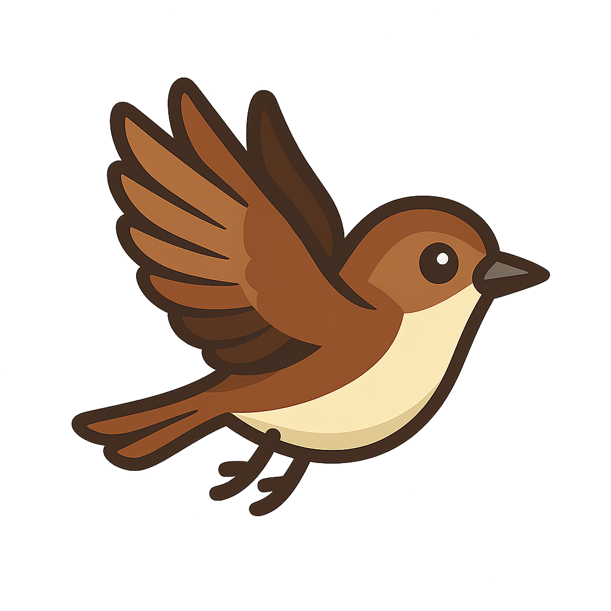

# 🐦 BirdDash - Coffee-Themed Endless Runner

A modern, coffee-themed endless runner game built with Phaser.js, featuring real-time leaderboards, user authentication, and responsive design.



## 🎮 Game Features

- **Endless Runner Gameplay**: Navigate through a coffee-themed world
- **Collectibles**: Gather coffee beans, smoothies, bagels, and special items
- **Power-ups**: Shield, speed boost, magnet, health, and special barista bonuses
- **Responsive Design**: Optimized for desktop and mobile devices
- **Real-time Leaderboards**: Compete with players worldwide
- **User Profiles**: Track your progress and achievements
- **Offline Support**: Play even without internet connection

## 🏗️ Tech Stack

### Frontend
- **Phaser.js 3.80.1** - Game engine
- **Vanilla JavaScript (ES6+)** - Game logic
- **HTML5 Canvas** - Rendering
- **Web Audio API** - Sound effects and music

### Backend
- **Node.js** - Server runtime
- **Express.js** - Web framework
- **SQLite** - Database
- **JWT** - Authentication
- **bcrypt** - Password hashing

## 🚀 Quick Start

### Development Setup

1. **Clone the repository**
   ```bash
   git clone https://github.com/yourusername/birddash.git
   cd birddash
   ```

2. **Install dependencies**
   ```bash
   npm install
   ```

3. **Set up environment variables**
   ```bash
   cp env.example .env
   # Edit .env with your configuration
   ```

4. **Start the development server**
   ```bash
   npm run dev
   ```

5. **Open the game**
   - Navigate to `http://localhost:3000`
   - Game will be available at the root path
   - API endpoints available at `/api`

### Production Deployment

#### Option 1: Railway (Recommended)
1. Connect your GitHub repository to Railway
2. Set environment variables in Railway dashboard
3. Deploy automatically on push to main branch

#### Option 2: Vercel
1. Install Vercel CLI: `npm i -g vercel`
2. Run `vercel` in project directory
3. Follow the deployment prompts

#### Option 3: Traditional VPS
1. Set up Node.js environment
2. Install dependencies: `npm install --production`
3. Start with PM2: `pm2 start server/server.js`

## 📁 Project Structure

```
birddash/
├── server/                 # Backend API
│   ├── routes/            # API endpoints
│   ├── database/          # Database setup
│   └── server.js          # Main server file
├── *.js                   # Game modules
├── *.png                  # Game assets
├── index.html             # Main HTML file
├── package.json           # Dependencies
└── README.md              # This file
```

## 🎯 Game Mechanics

### Controls
- **Desktop**: Spacebar or Click to fly/jump
- **Mobile**: Tap screen to fly/jump
- **Movement**: Automatic forward movement with gravity

### Collectibles
- ☕ **Coffee Beans**: 10-25 points
- 🥤 **Smoothies**: 30-60 points  
- 🥯 **Bagels**: 40-80 points
- 👨‍🍳 **Barista Bonus**: Special multi-effect power-up

### Power-ups
- 🛡️ **Shield**: Temporary invincibility
- ⚡ **Speed Boost**: Increased movement speed
- 🧲 **Magnet**: Auto-collect nearby items
- ❤️ **Health**: Restore health points
- 🔥 **Score Multiplier**: Double points for limited time

## 🏆 API Endpoints

### Authentication
- `POST /api/auth/guest` - Create guest user
- `POST /api/auth/register` - Register new account
- `POST /api/auth/login` - User login
- `GET /api/auth/verify` - Verify token

### Leaderboard
- `GET /api/leaderboard` - Get leaderboard (with pagination)
- `POST /api/leaderboard/submit` - Submit new score
- `GET /api/leaderboard/user/:username` - Get user scores
- `GET /api/leaderboard/stats` - Get leaderboard statistics

### Users
- `GET /api/users/:username` - Get user profile
- `POST /api/users/:username/game-complete` - Update game stats
- `GET /api/users/:username/achievements` - Get user achievements

## 🎵 Audio Assets

- **Background Music**: `lambada-bossa-279769.mp3`
- **Sound Effects**: Generated using Web Audio API
- **Music Toggle**: In-game music control

## 📱 Responsive Features

- **16:9 Aspect Ratio**: Optimized for modern displays
- **Mobile Controls**: Touch-friendly interface
- **Scalable UI**: Elements resize based on screen size
- **Performance Optimized**: Efficient rendering and physics

## 🏅 Achievement System

- **First Flight**: Play your first game
- **Coffee Connoisseur**: Score 1000+ points
- **Barista Master**: Score 5000+ points
- **Regular Customer**: Play 10+ games
- **Coffee Addict**: Play 50+ games
- **Collector**: Collect 100+ items in one game
- **Long Distance Flyer**: Travel 10,000+ units

## 🔧 Development

### Available Scripts
- `npm start` - Start production server
- `npm run dev` - Start development server with nodemon
- `npm run build` - Build for production (static frontend)

### Environment Variables
```bash
PORT=3000
NODE_ENV=development
DATABASE_URL=./database/birddash.db
JWT_SECRET=your-secret-key
JWT_EXPIRES_IN=7d
ALLOWED_ORIGINS=http://localhost:8001,http://localhost:3000
```

## 🐛 Troubleshooting

### Common Issues
1. **Port already in use**: Change PORT in .env file
2. **Database locked**: Restart server to release locks
3. **Assets not loading**: Check file paths and permissions
4. **Audio not playing**: Ensure user interaction before audio

### Debug Mode
- Open browser console (F12)
- Look for debug messages prefixed with emojis
- Check network tab for API calls

## 📄 License

MIT License - see LICENSE file for details

## 🤝 Contributing

1. Fork the repository
2. Create a feature branch: `git checkout -b feature-name`
3. Commit changes: `git commit -am 'Add feature'`
4. Push to branch: `git push origin feature-name`
5. Submit a pull request

## 🎯 Future Features

- [ ] Daily challenges
- [ ] Multiplayer mode
- [ ] More power-ups and collectibles
- [ ] Seasonal themes
- [ ] Social features
- [ ] Mobile app version

---

**Made with ☕ and ❤️ by Dayne Levin-Rad**

For support or questions, please open an issue on GitHub.
